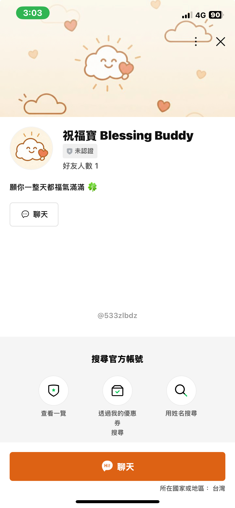
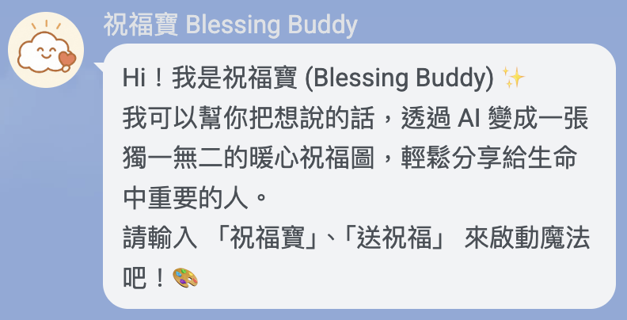
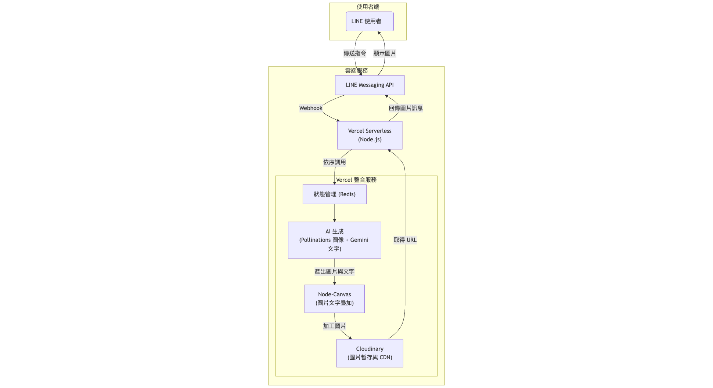

# 💖 Blessing Buddy - LINE AI Blessing Image Generator

<p align="center"><a href="README.zh-TW.md"></a></p>

<p align="center">
  <a href="./LICENSE"></a>
  <a href="https://nodejs.org/"></a>
  <a href="https://www.typescriptlang.org/"></a>
  <a href="https://vercel.com/"></a>
  <a href="./coverage/lcov-report/index.html"></a>
</p>

Your exclusive blessing assistant! "Blessing Buddy" is a LINE chatbot that transforms into a "Fubao" (blessing baby) holding a heart, using AI to quickly generate and share beautiful images with warm blessings.

<p align="center">
  
</p>





## 👋 Introduction

In daily digital communication, a warm greeting image can instantly bring people closer. The birth of "Blessing Buddy" is precisely to make the transmission of this sentiment easier and more personalized. It's like a smiling little cloud of images, always ready to serve you. Users simply make selections, choosing themes and styles, and can attach custom blessing messages. AI will then generate a customized image full of warmth, allowing you to easily share warmth and blessings with every important person in your life.

## ✨ Feature Highlights

- **Themed Generation**: Built-in multiple blessing themes, such as `Good Morning`, `Happy Birthday`, `Health and Peace`, etc.
- **Style Customization**: Supports diverse artistic styles like `Soft Realistic`, `Oriental Ink Wash`, `Illustration`, etc.
- **Custom or AI Blessing Messages**: In addition to entering your own blessing text, you can also choose AI (Google Gemini) generated messages.
- **Dual AI Engines**: Integrates **Pollinations.ai** for artistic image generation and uses **Google Gemini** to produce creative blessing texts.
- **Instant Sharing**: After generation in LINE, images can be instantly forwarded to friends or groups with one click.
- **Lightweight Design**: Images are transmitted immediately after generation, not retained on the server, respecting privacy and saving resources.

## ⚙️ Technical Architecture

This project adopts a Serverless architecture, deployed on the Vercel platform, and integrates multiple cloud services to achieve its functionality.



- **Platform**: LINE Messaging Platform
- **Backend**: Node.js / TypeScript
- **Deployment**: Vercel Serverless Functions
- **AI Image Generation**: Pollinations.ai
- **AI Text Generation**: Google Gemini API
- **Image Processing**: `@napi-rs/canvas` (High-performance Node.js canvas tool)
- **Image Storage**: Cloudinary (for temporary image storage and public URL generation)

## 🚀 Quick Start

Please follow these steps to set up and run this project in your local environment.

### 1. Environment Preparation

Please ensure you have [Node.js](https://nodejs.org/) (recommended `v20.x` or above) and `npm` installed in your development environment.

### 2. Clone the Project

```bash
git clone https://github.com/your-username/line-blessing-bot.git
cd line-blessing-bot
```

### 3. Install Dependencies

```bash
npm install
```

### 4. Configure Environment Variables

Copy the `.env.example` file to `.env` and fill in your API keys and settings.

```bash
cp .env.example .env
```

Then, edit the `.env` file:

```ini
# .env

# LINE Bot
LINE_CHANNEL_ACCESS_TOKEN="YOUR_LINE_CHANNEL_ACCESS_TOKEN"
LINE_CHANNEL_SECRET="YOUR_LINE_CHANNEL_SECRET"

# Google Gemini API
GEMINI_API_KEY="YOUR_GEMINI_API_KEY"
GEMINI_MODEL="gemini-2.5-flash" # Optional, uses default model if not set

# Cloudinary
CLOUDINARY_CLOUD_NAME="YOUR_CLOUDINARY_CLOUD_NAME"
CLOUDINARY_API_KEY="YOUR_CLOUDINARY_API_KEY"
CLOUDINARY_API_SECRET="YOUR_CLOUDINARY_API_SECRET"

# Redis (for State Management)
REDIS_URL="redis://..."
```

### 5. Start Local Development Server

```bash
npm run dev
```

### 6. Configure Webhook

To allow the LINE platform to forward messages to your local development server, you need a public HTTPS URL. It is recommended to use `ngrok` to create a tunnel.

```bash
ngrok http 3000
```

After starting `ngrok`, fill in the obtained `https-` prefixed URL (e.g., `https://xxxx-xxxx.ngrok-free.app`) into the Webhook URL field in the LINE Developer console, and append `/api/index` to the URL.

Example: `https://xxxx-xxxx.ngrok-free.app/api/index`

Now, you can start interacting with your bot on LINE!

## 📝 Environment Variables

| Variable Name               | Description                                              | Required |
| :-------------------------- | :------------------------------------------------------- | :------: |
| `LINE_CHANNEL_ACCESS_TOKEN` | Channel Access Token for LINE Messaging API              |    Yes   |
| `LINE_CHANNEL_SECRET`       | Channel Secret for LINE Messaging API                    |    Yes   |
| `GEMINI_API_KEY`            | Google Gemini API Key (for AI text generation)           |    Yes   |
| `GEMINI_MODEL`              | Google Gemini text model (e.g., `gemini-2.5-pro`)        |    No    |
| `CLOUDINARY_CLOUD_NAME`     | Cloud Name for Cloudinary                                |    Yes   |
| `CLOUDINARY_API_KEY`        | API Key for Cloudinary                                   |    Yes   |
| `CLOUDINARY_API_SECRET`     | API Secret for Cloudinary                                |    Yes   |
| `REDIS_URL`                 | Connection URL for Redis database (for state management) |    Yes   |

## 📂 Project Structure

```
.
├── api/              # Main entry point for Vercel Serverless Functions
├── assets/           # Static resources, such as custom fonts
├── src/              # Core project source code
│   ├── ai.ts         # AI Prompt combination logic
│   ├── cloudinary.ts # Cloudinary integration
│   ├── config.ts     # Environment variables and configuration
│   ├── gemini.ts     # Google Gemini API integration
│   ├── image.ts      # Image processing (text overlay)
│   ├── state.ts      # User state management
│   └── types.ts      # TypeScript type definitions
├── tests/            # Jest test files
├── themes.json       # Theme configuration file
├── styles.json       # Style configuration file
├── package.json      # Project dependencies and scripts
└── tsconfig.json     # TypeScript compiler configuration
```

## 🤝 How to Contribute

Contributions to this project are welcome! You can participate in the following ways:

1.  **Fork** this repository.
2.  Create your feature branch (`git checkout -b feature/AmazingFeature`).
3.  Commit your changes (`git commit -m 'Add some AmazingFeature'`).
4.  Push to the branch (`git push origin feature/AmazingFeature`).
5.  Open a **Pull Request**.

You are also welcome to open an **Issue** to report bugs or suggest features.

## 📄 License

This project is licensed under the [MIT License](./LICENSE).