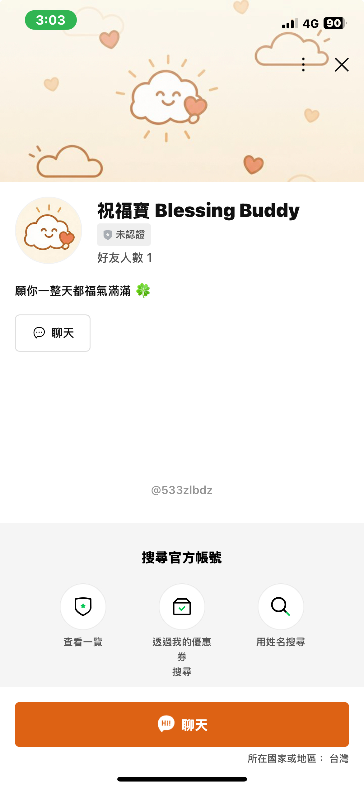
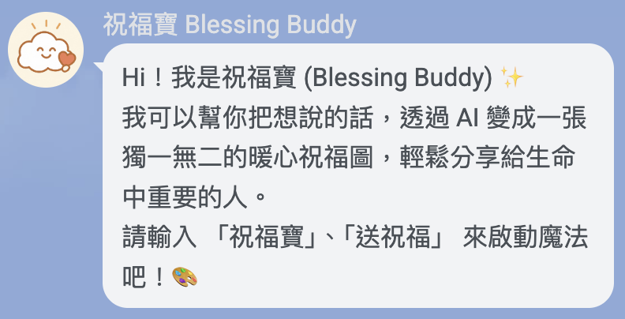
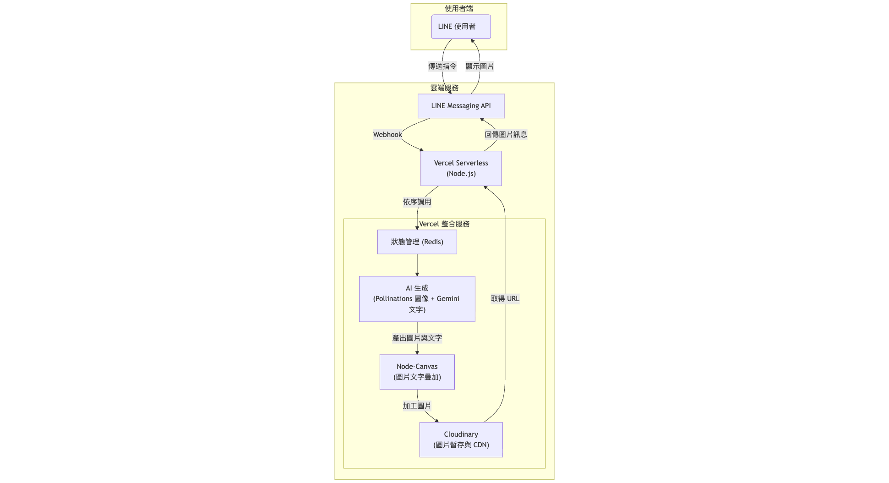

# 💖 祝福寶 (Blessing Buddy) - LINE AI 祝福圖生成器

<p align="center"><a href="README.md"></a></p>

<p align="center">
  <a href="./LICENSE"></a>
  <a href="https://nodejs.org/"></a>
  <a href="https://www.typescriptlang.org/"></a>
  <a href="https://vercel.com/"></a>
  <a href="./coverage/lcov-report/index.html"></a>
</p>

你的專屬祝福小幫手！「祝福寶」是一個 LINE 聊天機器人，它化身為一個拿著愛心的福寶，用 AI 為你快速生成並分享帶有溫暖祝福的精美圖片。

<p align="center">
  
</p>





## 👋 介紹

在日常的數位溝通中，一張溫暖的問候圖能瞬間拉近彼此的距離。「祝福寶 (Blessing Buddy)」的誕生，正是為了讓這份心意的傳遞變得更加輕鬆、個人化。它就像一個微笑的小圖雲，隨時準備好為你服務。使用者只需透過簡單的點選，選擇主題與風格，並可附上自訂的祝福語，AI 就會為您生成一張充滿溫情的客製化圖片，讓您輕鬆地將溫暖與祝福分享給生命中每一位重要的人。

## ✨ 功能亮點

- **主題式生成**：內建多種祝福主題，如 `早安`、`生日快樂`、`健康平安` 等。
- **風格客製化**：支援 `柔光寫實`、`東方水墨`、`插畫風` 等多樣化的藝術風格。
- **自訂或 AI 祝福語**：除了可輸入自己的祝福文字，也可選擇由 AI (Google Gemini) 生成。
- **雙 AI 引擎**：整合 **Pollinations.ai** 進行藝術圖片生成，並採用 **Google Gemini** 產生富有創意的祝福文案。
- **即時分享**：在 LINE 中生成後，可一鍵將圖片轉傳給好友或群組。
- **輕量化設計**：圖片生成後即時傳送，伺服器不保留，尊重隱私且節省資源。

## ⚙️ 技術架構

本專案採用 Serverless 架構，部署於 Vercel 平台，並整合多個雲端服務來實現其功能。



- **平台**：LINE Messaging Platform
- **後端**：Node.js / TypeScript
- **部署**：Vercel Serverless Functions
- **AI 圖像生成**：Pollinations.ai
- **AI 文字生成**：Google Gemini API
- **圖片處理**：`@napi-rs/canvas` (高效能的 Node.js 畫布工具)
- **圖片儲存**：Cloudinary (用於暫存圖片並產生公開 URL)

## 🚀 快速開始

請依照以下步驟在您的本機環境中設定並執行此專案。

### 1. 環境準備

請先確認您的開發環境已安裝 [Node.js](https://nodejs.org/) (建議版本 `v20.x` 或以上) 與 `npm`。

### 2. 複製專案

```bash
git clone https://github.com/your-username/line-blessing-bot.git
cd line-blessing-bot
```

### 3. 安裝依賴

```bash
npm install
```

### 4. 設定環境變數

複製 `.env.example` 檔案為 `.env`，並填入您自己的 API 金鑰與設定。

```bash
cp .env.example .env
```

接著，編輯 `.env` 檔案：

```ini
# .env

# LINE Bot
LINE_CHANNEL_ACCESS_TOKEN="YOUR_LINE_CHANNEL_ACCESS_TOKEN"
LINE_CHANNEL_SECRET="YOUR_LINE_CHANNEL_SECRET"

# Google Gemini API
GEMINI_API_KEY="YOUR_GEMINI_API_KEY"
GEMINI_MODEL="gemini-2.5-flash" # 可選，若未設定則使用預設模型

# Cloudinary
CLOUDINARY_CLOUD_NAME="YOUR_CLOUDINARY_CLOUD_NAME"
CLOUDINARY_API_KEY="YOUR_CLOUDINARY_API_KEY"
CLOUDINARY_API_SECRET="YOUR_CLOUDINARY_API_SECRET"

# Redis (for State Management)
REDIS_URL="redis://..."
```

### 5. 啟動本地開發伺服器

```bash
npm run dev
```

### 6. 設定 Webhook

為了讓 LINE 平台能將訊息轉發到您的本地開發伺服器，您需要一個公開的 HTTPS 網址。推薦使用 `ngrok` 來建立通道。

```bash
ngrok http 3000
```

啟動 `ngrok` 後，將取得的 `https-` 開頭的網址（例如 `https://xxxx-xxxx.ngrok-free.app`）填入 LINE Developer 後台的 Webhook URL 欄位，並在網址後方加上 `/api/index`。

範例：`https://xxxx-xxxx.ngrok-free.app/api/index`

現在，您可以開始在 LINE 上與您的機器人互動了！

## 📝 環境變數

| 變數名稱                    | 說明                                                     | 必填 |
| --------------------------- | -------------------------------------------------------- | :--: |
| `LINE_CHANNEL_ACCESS_TOKEN` | LINE Messaging API 的 Channel Access Token               |  是  |
| `LINE_CHANNEL_SECRET`       | LINE Messaging API 的 Channel Secret                     |  是  |
| `GEMINI_API_KEY`            | Google Gemini API 金鑰 (用於 AI 文字生成)                |  是  |
| `GEMINI_MODEL`              | Google Gemini 的文字模型 (例如 `gemini-2.5-pro`)         |  否  |
| `CLOUDINARY_CLOUD_NAME`     | Cloudinary 的 Cloud Name                                 |  是  |
| `CLOUDINARY_API_KEY`        | Cloudinary 的 API Key                                    |  是  |
| `CLOUDINARY_API_SECRET`     | Cloudinary 的 API Secret                                 |  是  |
| `REDIS_URL`                 | Redis 資料庫的連線網址 (用於狀態管理)                  |  是  |

## 📂 專案結構

```
.
├── api/              # Vercel Serverless Function 主要進入點
├── assets/           # 靜態資源，如自訂字型
├── src/              # 專案核心原始碼
│   ├── ai.ts         # AI Prompt 組合邏輯
│   ├── cloudinary.ts # Cloudinary 整合
│   ├── config.ts     # 環境變數與設定檔
│   ├── gemini.ts     # Google Gemini API 整合
│   ├── image.ts      # 圖片處理 (文字疊加)
│   ├── state.ts      # 使用者狀態管理
│   └── types.ts      # TypeScript 型別定義
├── tests/            # Jest 測試檔案
├── themes.json       # 主題設定檔
├── styles.json       # 風格設定檔
├── package.json      # 專案依賴與腳本
└── tsconfig.json     # TypeScript 編譯器設定
```

## 🤝 如何貢獻

歡迎您為這個專案做出貢獻！您可以透過以下方式參與：

1.  **Fork** 此專案。
2.  建立您的功能分支 (`git checkout -b feature/AmazingFeature`)。
3.  提交您的變更 (`git commit -m 'Add some AmazingFeature'`)。
4.  將您的分支推送到遠端 (`git push origin feature/AmazingFeature`)。
5.  開啟一個 **Pull Request**。

也歡迎您開啟 **Issue** 來回報問題或提出功能建議。

## 📄 授權條款

本專案採用 [MIT](./LICENSE) 授權條款。
